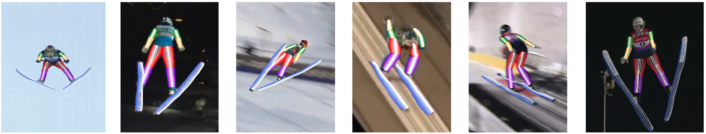

# Detecting Arbitrary Keypoints on Limbs and Skis with Sparse Partly Correct Segmentation Masks



This repository is the official implementation of 
[Detecting Arbitrary Keypoints on Limbs and Skis with Sparse Partly Correct Segmentation Masks](https://arxiv.org/abs/2211.09446). 

The paper is accepted for [CV4WS'23](https://machinelearning.uniud.it/events/CV4WS-2023/Home.html) at 
[WACV'23](https://wacv2023.thecvf.com). 

## Dataset

You can download the dataset [here](https://www.uni-augsburg.de/en/fakultaet/fai/informatik/prof/mmc/research/datensatze/). 
After downloading, you need to download the videos from YouTube and extract the annotated frames. 
The annotated frames are expected to be located in a folder has subfolders for each video (named by its index)
and each subfolder contains the frames with the following naming convention: `<video_id>_(<frame_num>).jpg`,
whereby the frame num is five-digit, e.g.`<frames_path>/0/0_(01944).jpg`.

## Evaluation

Install all requirements in `requirements.txt`.
Before running, you need to adjust the paths in `paths.py`. You need to set the path to the extracted frames, 
the path to the downloaded folder, the weights path and a file where the inference results will be dumped. 
The pretrained weights are located in `model/pretrained/model_seg_proj.pth.tar`.
If you want to use another GPU than 0, adjust it in the header of `evaluation/eval_yt_skijump.py`. Then, run this file:

```bash
python -m evaluation.eval_yt_skijump.py
```

## Citation
In case this work is useful for your research, please consider citing:

    @InProceedings{ludwig2023arbitrary_kps,
    title     = {Detecting Arbitrary Keypoints on Limbs and Skis with Sparse Partly Correct Segmentation Masks},
    author    = {Ludwig, Katja and Kienzle, Daniel and Lorenz, Julian and Lienhart, Rainer},
    booktitle = {Proceedings of the IEEE/CVF Winter Conference on Applications of Computer Vision (WACV)},
    month     = {January},
    year      = {2023},
}


## Acknowledgments

Our code is heavily influenced by the following projects:

* [TokenPose](https://github.com/leeyegy/TokenPose)
* [HigherHRNet](https://github.com/HRNet/HigherHRNet-Human-Pose-Estimation)

We are grateful to the corresponding authors for releasing their code. We use some of their code in our project.